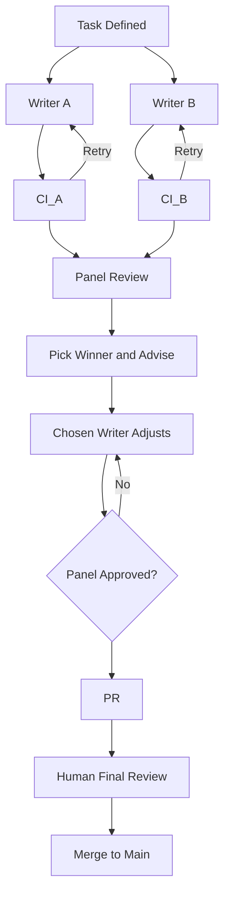
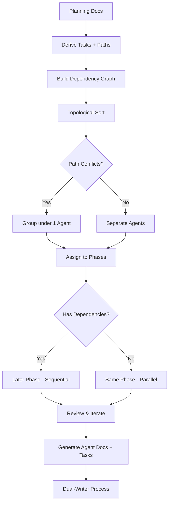
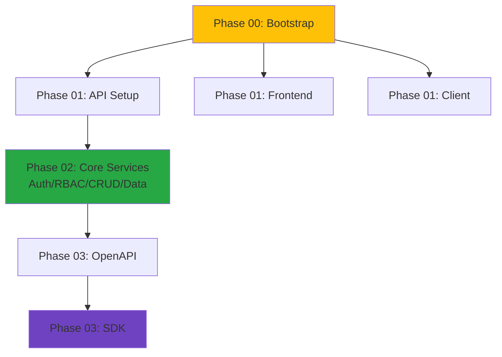

## The Agent Cube — A Multi‑Agent Coding Workflow

> **Framework Version:** 2.0 (Updated 2025-11-02)  
> **Key Update:** Added explicit Architecture Compliance checks and "Prefer Existing Tools" principle after task failure where AI agents built custom solution instead of using required tools, despite panel approval.

### Purpose

Orchestrate many LLM coding agents in parallel with near‑zero conflicts and production‑grade quality.

**The Cube**: Work mapped along three axes:

- **Phase axis**: Sequential gates (Phase 00 → 09) to minimize integration risk
- **Track axis**: Domain areas (Lifecycle, Auth, Data, SDK, etc.)
- **Ownership axis**: File path ownership to prevent conflicts (composition vs modules)

**Human‑assisted automation**: Agents collaborate; humans review final PRs and arbitrate conflicts.

### Core Principles

🎯 **#1: K.I.S.S (Keep It Simple, Stupid) — THE PRIMARY DIRECTIVE**

Every design decision, abstraction, and line of code must justify its existence.

- **Minimalistic**: Every line of code must earn its keep. Remove unnecessary abstractions.
- **Clean**: Readable > clever. Explicit > implicit. Direct > wrapped.
- **Elegant**: Simple solutions to complex problems. No gold plating or scope creep.
- **Question everything**: If it's a pass-through wrapper → delete it. If it duplicates existing info → remove it. If it's "for future flexibility" → YAGNI.

**Writers**: When implementing, constantly ask "Is this the simplest solution?"  
**Judges**: Actively look for and call out unnecessary complexity, abstractions, or code duplication.

---

**Other Core Principles:**

- **Planning‑driven**: Planning docs are the golden source of truth; do not invent requirements.
- **Prefer existing tools**: Always use established 3rd party libraries, generators, and tools over building custom solutions. Only build custom when no suitable option exists or planning docs explicitly require it.
- **Type safety**: Strict static typing; no `any`/unsafe casts; tests for non‑trivial code.
- **Security by default**: Tenancy from server auth context; server‑only secrets/flags; observability everywhere.
- **Priorities**: P1 = quality (planning‑aligned, simplest solution); P2 = parallel speed (only when it doesn't threaten P1).

### Generic Applicability

This framework is project‑agnostic. Replace planning docs with your own "golden source," then generate phases/agents/tasks.

---

## How It Works

### Architecture Overview

- **Phases**: Clear directory structure (e.g., `phases/phase-XX/`) with `agents/` and `tasks/` folders.
- **Agents**: LLM instances spun up as needed; each has an ID by phase (Agent 0, 1A, 1B, 2A, …) and owns specific task files.
- **Integrator (Agent 0)**: Exclusively composes at composition roots (`index.ts` files and config indices). Modules export their public APIs; Integrator wires them in `index.ts`. Do not put registration logic inside module functions.
- **Quality gates**: CI enforces lint/type/tests, reversible migrations (up→down), API contract validation (OpenAPI), and integration tests.
- **PRs**: Human reviews all final PRs before merge to main; PRs kept small but complete per task.

### Recommended LLM Models

**Writers**: GPT-5 Codex High, Claude Sonnet 4.5

- Keep temperature low for deterministic output
- Use planning docs verbatim; no scope drift
- Branch slug convention: `writer-codex/{task-id}` for GPT-5 Codex High, `writer-sonnet/{task-id}` for Claude Sonnet 4.5 (extend pattern for any additional models)

**Panel (3 judges)**: Claude Sonnet 4.5, GPT-5 High Fast, Gemini 2.5 Pro

- Default lineup unless a human overrides
- Mix reasoning styles for better defect catch rate
- Rotate judges occasionally to reduce single-model bias; keep panel metrics updated when the lineup changes
- **Alternative panel options**: For code-heavy reviews, consider Grok Code instead of Gemini 2.5 Pro (code-focused model may catch technical issues better). Test and compare metrics before switching default.

---

## Dual‑Writer + LLM Panel Process

**Default for all tasks (including composition).** For composition roots, the Integrator applies the final `index.ts` change.

### Setup

- **Universal writer prompt**: Orchestrator issues a single, generic prompt to both writers. The prompt includes instructions for writers to identify their model and select the appropriate branch name (e.g., `writer-sonnet/{task-id}` for Claude Sonnet 4.5, `writer-codex/{task-id}` for GPT-5 Codex High). This allows the same prompt to be used for both writers without modification.
- Owned paths only; no scope beyond planning docs; low temperature for determinism.
- Writers work independently without coordination; each retries until CI passes.
- **CRITICAL**: Each writer must `git commit` and `git push` their branch before handing off. Uncommitted or unpushed work is NOT submitted and will NOT be reviewed. Final summary must state the branch name and confirm push succeeded with `git status` verification.
- CI runs via GitHub Actions (GHA) from `.github/workflows/*.yml`.

### LLM Panel

Odd number of LLM agents (e.g., 3); same panel used for solution selection and peer review.
**Solution Selection (checklist + majority vote):**

- Considerations: planning conformance; simplicity (KISS); type safety; tenancy/RBAC; error envelope; observability; tests/migrations; performance/security.
- No numeric scores. Each panelist writes brief notes, then votes A or B. Majority wins. Tie‑breakers in order: planning conformance → tenancy/RBAC → error handling → simplicity.
- Compatibility assessment required for synthesis (see below).

**Synthesis & Retry Loop:**

- Combine only if compatible: same public API surface; no divergent schema or error envelopes; compatible owned paths; both CI green. Otherwise, pick primary only.
- Primary writer applies synthesis; no new features. Run CI (lint/type/tests, up→down migrations, OpenAPI/SDK) via GHA.
- If picked without synthesis, the chosen writer MUST apply panel-requested adjustments (naming, tests, conformance) before opening the PR.
- Cap at 5 synthesis retries or 60 minutes of elapsed effort before escalating to human. Human can waive caps.

**Peer Review:**

- Same panel performs critical review against planning docs and code standards.
- Review cycles with author until approved; human arbitrates deadlocks.
- No self‑review; scope discipline enforced.
- Review the final PR after synthesis has been applied (not the dual-writer solutions).
- Use the Code Review Checklist (see Templates section) to ensure all criteria are met.

### Human Final Review

- Human reviews PR before merge to main; ensures quality and planning alignment.

### Guardrails

- No composition file edits; obey owned paths; no invented fields/behaviors; simplest solution that meets acceptance.
- Timebox uncertainty: if blocked >60 minutes or after 5 retry loops, add an entry to `planning/tbd.md` and escalate to human. Use conservative defaults until resolved.

### Process Flow Diagram



---

## Phase & Agent Structure

### Agent IDs and Phases

- Phase 00 — Bootstrap & Governance: Agent 0 (+ support 0A…0G)
- Phase 01 — Service Setup: Agents 1A (API server), 1G (Frontend), 1H (API client)
- Phase 02 — Core Services: Agents 2A (Lifecycle), 2B (Auth/RBAC/Tenancy), 2C (CRUD Factory), 2D (Data/Migrations)
- Phase 03 — Contracts & SDK: Agents 3A (OpenAPI), 3B (SDK)
- Phase 04 — Exemplar Integration: Agent 4 (Exemplar e2e)
- Phase 05 — Platform Capabilities: Agents 5A (Rate limit), 5B (Flags), 5C (Breakers)
- Phase 06 — Async & Uploads: Agents 6A (Jobs), 6B (Uploads)
- Phase 07 — Observability & SLOs: Agents 7A (OTel completeness), 7B (SLOs/alerts)
- Phase 08 — Security & Testing: Agents 8A (Security/Compliance), 8B (Testing)
- Phase 09 — Hardening & Release: Agent 9 (Perf/chaos/smoke/release)

### Universal Agent Instructions

- You are agent X. Read your phase README, agent doc under `agents/`, task tickets under `tasks/`, and linked planning docs.
- Edits within owned paths only; follow `index.ts` composition pattern; Integrator wires composition.
- Implement acceptance criteria precisely; no extra fields or behaviors.
- **Prefer existing tools**: Use established 3rd party libraries, generators, and tools over custom code. Only build custom when no suitable option exists or planning docs explicitly require it.
- If you are a writer: identify your model and create branch `writer-<model-slug>/{task-id}` where `<model-slug>` matches your model (e.g., `sonnet` for Claude Sonnet 4.5, `codex` for GPT-5 Codex High). Do not coordinate with the other writer.
- Quality before PR: lint/type/tests green; tenancy tests; migrations reversible; OpenAPI valid; required OTel attributes; structured logs; error envelope.
- PR protocol: Title `[Agent X] {task-id} — {summary}`; scope to owned files; add "Integration Notes"; link task file and planning docs.

---

## Operational Rules

### Conflict Minimization & Resolution

- Composition/config indices are single‑owner (Integrator). Modules export their APIs; Integrator composes in `index.ts` files. No module-level "register" functions.
- Shared types changes require Integrator approval to avoid cascades.
- Integrator merges composition as tasks complete (task‑driven, not time‑based); other agents avoid composition files.
- If file conflicts occur: agent attempts resolution first; if uncertain, escalate to human.
- If review deadlock occurs: human arbitrates.
- If synthesis introduces bugs: revert to primary winner; skip synthesis.

### Parallelization Rules

- Start a phase only after the previous phase's gate is met (task completion, not time‑based).
- Within a phase, run agents in parallel when owned paths do not overlap.
- When in doubt, group tasks under one agent to reduce risk.
- If blocked on a dependency, flag in phase README and add TBD entry with conservative default (internal‑only, stricter validation, fewer privileges).
- Each eligible task spawns two writer branches (A and B) that proceed independently into the LLM Panel.

### Orchestration

- **Default orchestrator: Cursor Composer** (recommended). Cursor Composer is well-suited as the default orchestrator because it:
  - Is already integrated in Cursor (no additional setup)
  - Can read planning docs, task files, and codebase state
  - Can generate universal prompts and track todos
  - Integrated in Cursor (no additional setup)
  - Fits the scale of dual-writer + 3-judge panel workflows
- **Current implementation**: Python `cube` CLI orchestrates autonomous workflows via cursor-agent, gemini CLI, and other adapters. Supports headless execution with state management, streaming output, and resume capabilities.
- Orchestration uses ports & adapters pattern: pluggable CLI tools, parsers for different output formats, and layout adapters for display.
- **Fully automated**: `cube auto task.md` handles entire workflow (writers → judges → synthesis → peer review → PR) autonomously with human validation only for final merge.

### PR Quality Gates (CI)

- GHA CI: lint, typecheck, unit and integration tests.
- Reversible migrations (up→down) for any schema change.
- Contract validation: OpenAPI generation and SDK build where impacted.
- Performance budgets: e.g., k6 smoke for API; Lighthouse for web (when applicable).

---

## Planning Foundation

### Golden Source Planning Templates

For any project, maintain these planning documents as the source of truth:

- Architecture Overview: scope, services, boundaries, diagrams, invariants.
- API Conventions: versioning, request/response envelopes, error schema, headers, pagination, rate limits.
- Error Handling: canonical error taxonomy, envelopes, mapping rules, debug policy.
- Observability & Logging: tracing setup, required attributes, log structure, redaction, metrics catalog, budgets.
- Domain & Data: domain model, repository/port contracts, schema conventions, IDs, soft‑delete/rules.
- Migrations: expand/contract strategy, reversibility policy, tooling, CI checks.
- Security & Compliance: authN/Z, RBAC, secrets/config, input hardening, auditing, SCA/SAST gates.
- Client/SDK: SDK target languages, generation strategy, versioning policy, examples.
- Frontend Architecture: routing, data‑fetching strategy, error/loading UX, state management.
- Feature Flags: server‑side evaluation policy, rollout safety, telemetry.
- Async Jobs & Integrations: job contracts, idempotency, retries, webhooks, provider adapters.
- Networking & Resilience: ingress/egress, timeouts, circuit breakers, backoff.
- Testing Strategy: unit/integration/contract/e2e, coverage targets, performance smoke.
- CI/CD & Environments: pipeline stages, preview envs, release/rollback policy.
- TBD/Decisions: open questions, owners, due dates, conservative defaults.

### Third-Party Tool Documentation Workflow

**Purpose:** Ensure agents use the latest APIs and patterns from third-party tools (e.g., DaisyUI v5, Tailwind v4), avoiding outdated training data.

**Version Registry:**
- Maintain `planning/third-party-versions.md` as single source of truth for required tool versions
- Include: tool name, required version, documentation links, key changes from previous versions

**Tool-Specific Planning Docs:**
- Create dedicated planning docs for critical tools (e.g., `planning/daisyui-v5.md`, `planning/tailwindcss-v4.md`)
- Include: principles, usage patterns (good/bad examples), anti-patterns, external documentation links
- Structure external doc references with: URL, "why this matters", estimated reading time

**Task File Integration:**
- Mark critical planning docs with `[KEY]` in task files' Context section
- Orchestrator should automatically include full content of [KEY] planning docs in writer prompts
- Non-KEY planning docs are included as references only
- Add "Required Reading" section in task files with mandatory external documentation links

**Required Reading Section Format:**
```markdown
## 📚 Required Reading (MANDATORY)

### [Tool Name] (e.g., DaisyUI v5)

**Documentation:**
- **Primary Docs:** [URL]
  - **Why:** [e.g., "We use v5, NOT v4 - API has breaking changes"]
  - **Time:** [e.g., "15 minutes"]

**Sections to read:**
- **[Section Name]:** [URL to specific section]
  - **Focus on:** [What to pay attention to]

**Critical:** Judges will verify:
- ✅ Correct versions used
- ✅ Documented patterns followed
- ✅ No deprecated APIs
```

**Enforcement:**
- Judges check architecture compliance during panel review (PASS/FAIL)
- Verify agents used correct tool versions from planning docs
- Confirm patterns match latest external documentation
- Flag use of deprecated or outdated APIs as automatic failure

**Best Practices for Documentation Links:**
- Link to specific sections, not just homepage
- Include version in URL when possible (e.g., `/docs/v5/`)
- Explain WHY each link matters
- Provide reading time estimates
- Mark critical vs. optional reading
- Update links when versions change

**Templates:**
- Use `templates/task-template.md` for task file structure with Required Reading section
- Use `templates/planning-doc-template.md` for creating tool-specific planning docs

### Initial Orchestrator Outputs

An orchestrator/lead agent should generate:

1. Phase skeleton: `phases/phase-XX/{agents,tasks}/` directories
2. Ownership matrix: file/path globs → agent owners (composition files are single‑owner)
3. Reviewer assignments and review checklist
4. Phase‑specific agent docs: role scope, owned paths, linked tasks
5. Task tickets: atomic steps with acceptance criteria and planning links
6. CI hooks: quality gates each task must satisfy

---

## Phase & Task Derivation Algorithm

### Multi‑pass Grouping (Conflict‑Aware, Conservative)

**Step 1: Derive tasks**  
Parse golden planning docs → list atomic tasks with acceptance criteria and affected paths.

**Step 2: Annotate ownership**  
Tag tasks with owned path globs; mark any composition/config indices as Integrator‑only.

**Step 3: Build a dependency graph**  
From acceptance criteria and doc constraints, link task prerequisites (nodes/edges).

**Step 4: Cluster by paths to avoid overlap**  
Greedily assign tasks with disjoint path sets to separate agents; merge tasks with shared paths under one agent to reduce conflicts.

**Step 5: Phase assignment**  
Place clusters into phases by topological order; open parallel windows only when inputs are stable. When in doubt, serialize (P1 > P2).

**Step 6: Reviewer pairing**  
Assign cross‑track reviewers that do not own the same files to maximize defect discovery without conflicts.

**Step 7: Gate definition**  
For each phase, define explicit gates (what CI/acceptance must pass) before the next phase can start.

**Step 8: Iterate**  
After the first pass, review hotspots (overlaps, unclear ownership); move tasks between agents or phases to remove conflicts. Prefer grouping to reduce coordination if uncertain.

### Heuristics

- Prefer single‑owner clusters for high‑churn areas.
- Keep tasks small but meaningful (able to pass CI in isolation).
- Use stubs/registrations for integration; Integrator wires as tasks complete.

### Derivation Flow Diagram



### Dependency Patterns Diagram



---

## Templates & Examples

### Task Ticket Template

```markdown
## Task: <short name>

Summary:

- What to build and why (1–2 sentences)

## Required Reading (MANDATORY)

**YOU MUST READ AND FOLLOW THESE PLANNING DOCS:**

- `planning/<doc-1>.md` - [Why this matters for this task]
- `planning/<doc-2>.md` - [Why this matters for this task]

**Key Architectural Decisions (Non-Negotiable):**

- [Specific architectural choice that must be followed]
- [Tool/library that must be used, not alternatives]
- [Pattern that must be implemented]

Steps:

1. …
2. …
3. …

Acceptance criteria:

- [ ] Behavior …
- [ ] Tests …
- [ ] CI gates …
- [ ] **Architecture Compliance:** Follows all planning docs listed above

Affected paths (owned):

- path/glob 1
- path/glob 2

References (golden planning docs):

- <link to API conventions / error handling / etc>
```

### Agent Doc Template

```markdown
## Agent <ID> — <Role>

Scope:

- Owned paths: …
- Out of scope: …

Tasks:

- tasks/<id-A>.md
- tasks/<id-B>.md

Notes:

- Follow index.ts composition; Integrator wires composition.
```

### Universal Writer Prompt Template

The orchestrator issues this single prompt to both writers. Writers identify themselves and select the appropriate branch name.

```markdown
You are Agent <X> working on task <task-id>.md.

**Model identification:**

- Identify which model you are (Claude Sonnet 4.5, GPT-5 Codex High, etc.)
- Create branch: `writer-<model-slug>/<task-id>` where `<model-slug>` matches your model (e.g., `sonnet`, `codex`)

**Task:**
[Task description from task file]

**MANDATORY: Required Reading**

**YOU MUST READ AND FOLLOW THESE PLANNING DOCS:**

- `planning/<doc-1>.md` - [Why this matters]
- `planning/<doc-2>.md` - [Why this matters]

**Key Architectural Decisions (Non-Negotiable):**

- [Specific tool/library that MUST be used]
- [Pattern that MUST be implemented]
- [Architectural choice that cannot be changed]

**YOUR IMPLEMENTATION MUST:**

- Follow the architectural patterns specified in planning docs above
- Use the exact tools/libraries specified (no alternatives without human approval)
- Implement the patterns as documented (not as you think they should be)

**🎯 PRIMARY DIRECTIVE: K.I.S.S (Keep It Simple, Stupid)**

**CONTINUOUSLY ASK YOURSELF: "Is this the simplest solution?"**

- **Minimalistic**: Every line of code must earn its keep. Delete unnecessary abstractions.
- **Clean**: Readable > clever. Explicit > implicit. Direct > wrapped.
- **Elegant**: Simple solutions to complex problems. No gold plating.
- **Question everything**: Pass-through wrapper? Delete it. Duplicate type? Remove it. "For future flexibility"? YAGNI - don't build it.

**Acceptance Criteria:**
[From task file]

**Current State:**
[Current codebase state relevant to task]

**Planning Docs (Golden Source):**
[Links to relevant planning docs]

**Constraints:**

- Owned paths: [path globs]
- No composition file edits (Integrator wires `index.ts`)
- Follow planning docs exactly; no invented fields/behaviors
- **Prefer existing tools**: Use established 3rd party libraries/generators/tools over custom code. Only build custom when no suitable option exists or planning docs explicitly require it.
- Strict TypeScript; no `any`/unsafe casts
  [Additional constraints specific to task]

**Process:**

1. **FIRST:** Read all required planning docs listed above
2. Create branch: `writer-<model-slug>/<task-id>` (select `<model-slug>` based on your model)
3. Implement per acceptance criteria AND planning docs
4. Verify architectural compliance (tools, patterns, decisions)
5. Ensure CI passes (lint/typecheck)
6. **REQUIRED: Commit and push branch**

   **⚠️ CRITICAL: You MUST commit and push your work. Uncommitted or unpushed changes will NOT be reviewed by the panel.**
   - Run `git add <files>`
   - Run `git commit -m "feat: <description>"`
   - Run `git push origin writer-<model-slug>/<task-id>`
   - Verify push succeeded: `git status` should show "Your branch is up to date with 'origin/...'"

7. **REQUIRED: Provide final summary ONLY AFTER successful push:**
   - State your branch name
   - Confirm push succeeded
   - Example: "Writer codex complete for <task-id>. Branch writer-codex/<task-id> pushed successfully."

**Task File:** `implementation/phase-XX/tasks/<task-id>.md`
**Agent Doc:** `implementation/phase-XX/agents/agent-<X>.md`
```

### Code Review Checklist

- Planning followed exactly (no invented fields/behaviors)
- **Existing tools preferred**: Uses established 3rd party libraries/generators/tools where applicable (not custom code)
- KISS/minimalism; no unnecessary abstractions
- Strict typing; no `any`/unsafe casts
- Tenancy enforced (if multi‑tenant); no `org_id` from clients
- Error envelope/headers match conventions
- Observability: required attributes; structured logs; redaction
- Tests: unit/integration/contract; tenancy tests when applicable
- Migrations reversible (up→down) when schema changes
- Contract valid (OpenAPI) and SDK updated when applicable
- Performance/security: no N+1; bounded work; input hardening

### LLM Solution Selection Panel Prompt Template

The orchestrator issues this prompt to the 3-judge panel for dual-writer solution selection.

```markdown
**YOU ARE ACTING AS A JUDGE ON AN LLM PANEL. Your role is to REVIEW and VOTE, not to orchestrate or write prompts.**

You are **[Judge 1 / Judge 2 / Judge 3]** on a 3-judge LLM Panel reviewing dual-writer solutions.

**Your Identity:**

- Judge 1: Claude Sonnet 4.5
- Judge 2: GPT-5 High Fast
- Judge 3: Gemini 2.5 Pro

**CRITICAL: Identify which judge you are (1, 2, or 3) and provide YOUR INDIVIDUAL review only.**
**DO NOT:**

- Orchestrate the panel process
- Write prompts for other judges
- Create synthesis branches (the chosen writer does this)
- Act as if you are the orchestrator

**DO:**

- Review both Writer A and Writer B solutions
- Provide YOUR vote (A or B)
- Provide YOUR synthesis recommendations
- Follow the output format below

**Task Context:**

- **Task:** [task-id] - [task name]
- **Agent:** [Agent ID]

**Solutions to Review:**

- **Writer A Branch:** [branch-name] (Model: [model])
- **Writer B Branch:** [branch-name] (Model: [model])

**Task File:** `implementation/phase-XX/tasks/[task-id].md`
**Planning Docs Referenced:** [list all planning docs from task file]

**Acceptance Criteria:**
[From task file]

**YOUR INDIVIDUAL REVIEW PROCESS (do not orchestrate others):**

1. **Verify Architecture Compliance (CRITICAL - PASS/FAIL):**
   - Read the Required Reading section from task file
   - Check: Does solution use the specified tools/libraries? (not alternatives)
   - Check: Does solution implement the required patterns? (not custom approaches)
   - Check: Does solution follow architectural decisions from planning docs?
   - **This is a PASS/FAIL check** - wrong architecture = automatic failure

2. **Verify K.I.S.S Compliance (CRITICAL - PRIMARY DIRECTIVE):**
   - Check: Is this the simplest solution that meets requirements?
   - Check: Every abstraction, wrapper, type justifies its existence?
   - Check: No pass-through functions, duplicate types, or premature abstractions?
   - Check: Clean and readable (explicit > implicit, direct > wrapped)?
   - **Call out any unnecessary complexity** - this is a dealbreaker

3. **Review both solutions** against acceptance criteria and planning docs

4. **Assess compatibility** for potential synthesis:
   - Same public API surface? (if applicable)
   - Compatible configurations?
   - Compatible owned paths?
   - Both CI green?

5. **Evaluate against other considerations** (brief notes, no numeric scores):
   - Planning conformance (follows docs exactly)
   - Type safety (if applicable)
   - CI/CD standards (cache, parallel execution, PR gates)
   - Developer experience (hooks fast, clear errors)
   - Security (blocks .env files, proper handling)
   - Performance (cache usage, parallel execution, hook speed)

**YOUR OUTPUT FORMAT:**

Provide YOUR individual review using this format:

**Architecture Compliance (CRITICAL - PASS/FAIL):**

- Writer A: [✓ PASS | ✗ FAIL] - [Does it use required tools/patterns from planning docs?]
- Writer B: [✓ PASS | ✗ FAIL] - [Does it use required tools/patterns from planning docs?]
- **If either writer FAILS architecture compliance, they are automatically disqualified**

**K.I.S.S Compliance (CRITICAL - PRIMARY DIRECTIVE):**

- Writer A: [✓ PASS | ⚠️ CONCERNS | ✗ FAIL] - [Is this the simplest solution? Any unnecessary complexity?]
- Writer B: [✓ PASS | ⚠️ CONCERNS | ✗ FAIL] - [Is this the simplest solution? Any unnecessary complexity?]
- **Call out specific unnecessary code**: [List any pass-through wrappers, duplicate types, premature abstractions, etc.]

**Other Consideration Notes:**

- Planning conformance: [brief notes]
- Type safety: [brief notes]
- CI/CD standards: [brief notes]
- Developer experience: [brief notes]
- Security: [brief notes]
- Performance: [brief notes]

**Best Bits (file/line references):**

- From Writer A: [specific files/lines that are excellent]
- From Writer B: [specific files/lines that are excellent]

**Compatibility Assessment:**

- Compatible for synthesis? [Yes/No]
- If Yes: What can be combined? [details]
- If No: Why not? [conflicts]

**Vote:** [A or B | BOTH FAIL (if both failed architecture compliance)]

**Rationale:** [2-3 sentences explaining vote]

**Synthesis Instructions (if compatible):**

- [Specific instructions for combining best parts, planning-aligned only]
- [No new features, only improvements]

**CRITICAL REMINDER:**

- You are ONLY a judge - provide YOUR review and vote
- The orchestrator (not you) collects reviews and determines majority
- The orchestrator (not you) provides synthesis instructions to the chosen writer
- Do NOT create synthesis branches - the chosen writer does that
- Do NOT orchestrate other judges - just provide YOUR review
```

### LLM Peer Review Panel Prompt Template

The orchestrator issues this prompt to the same 3-judge panel after the chosen writer has applied synthesis and opened a PR.

```markdown
**YOU ARE ACTING AS A JUDGE ON AN LLM PANEL. Your role is to REVIEW and VOTE, not to orchestrate or write prompts.**

You are **[Judge 1 / Judge 2 / Judge 3]** performing peer review for PR #[number]: [PR Title].

**Your Identity:**

- Judge 1: Claude Sonnet 4.5
- Judge 2: GPT-5 High Fast
- Judge 3: Gemini 2.5 Pro

**CRITICAL: Identify which judge you are (1, 2, or 3) and provide YOUR INDIVIDUAL review only.**
**DO NOT:**

- Orchestrate the panel process
- Write prompts for other judges
- Act as if you are the orchestrator

**DO:**

- Review the PR code (after synthesis has been applied)
- Provide YOUR vote (APPROVE | REQUEST_CHANGES | COMMENT)
- Follow the output format below

**Task Context:**

- **Task:** [task-id] - [task name]
- **Agent:** [Agent ID]
- **Author:** [Writer model] on branch [branch-name]
- **PR:** [PR link or description]

**Task File:** `implementation/phase-XX/tasks/[task-id].md`
**Planning Docs Referenced:** [list all planning docs from task file]

**Review Scope:**
Review the final PR code (after synthesis has been applied) against:

1. Task acceptance criteria
2. Planning docs (golden source)
3. Code Review Checklist (below)
4. AGENTS.md rules and constraints

**Code Review Checklist (verify each):**

**Architecture Compliance (CRITICAL - PASS/FAIL):**

- [ ] **Required tools/libraries used** (as specified in Required Reading section of task file)
- [ ] **Required patterns implemented** (not custom alternatives)
- [ ] **Architectural decisions followed** (from planning docs, no deviations)
- [ ] **This is a PASS/FAIL check** - wrong architecture = REQUEST_CHANGES

**K.I.S.S Compliance (CRITICAL - PRIMARY DIRECTIVE):**

- [ ] **Simplest solution**: Every abstraction, wrapper, type, and line of code justifies its existence
- [ ] **No unnecessary code**: Pass-through functions deleted; duplicate types/enums removed; YAGNI enforced
- [ ] **Clean & readable**: Explicit > implicit; direct > wrapped; readable > clever
- [ ] **No gold plating**: Only what's needed, not what might be needed
- [ ] **This is CRITICAL** - unnecessary complexity = REQUEST_CHANGES

**Planning Conformance:**

- [ ] Planning docs followed exactly (no invented fields/behaviors)
- [ ] All referenced planning docs satisfied
- [ ] No scope creep beyond acceptance criteria

**Code Quality:**

- [ ] **Existing tools preferred**: Uses established 3rd party libraries/generators/tools where applicable (not custom code unless required)
- [ ] Strict typing: no `any`/unsafe casts; TypeScript strict mode
- [ ] Owned paths respected (no composition file edits unless Integrator)

**Security & Tenancy:**

- [ ] Tenancy: no `org_id` accepted from clients; context derived server-side (if applicable)
- [ ] Secrets/config: no client-side secrets; server-only env vars
- [ ] Input validation: Zod schemas for API contracts (if applicable)

**Error Handling:**

- [ ] Error envelope and headers match `planning/error-handling.md` conventions
- [ ] Proper HTTP status codes
- [ ] Error messages safe (no stack traces in prod)

**Observability:**

- [ ] Structured logs per `planning/logging.md` (JSON, redaction, context fields)
- [ ] Required OTel attributes included (if applicable)
- [ ] Correlation IDs (request ID, trace ID) present

**Testing:**

- [ ] Unit tests where applicable
- [ ] Integration tests (tenancy tests if CRUD)
- [ ] CI passes (lint/typecheck/tests)

**Migrations:**

- [ ] Reversible up→down (if schema changes)
- [ ] Down migration tested

**API Contracts:**

- [ ] OpenAPI updated and valid (if API changes)
- [ ] SDK regenerated (if API changes)

**Performance & Security:**

- [ ] No N+1 queries
- [ ] Pagination limits set (if list endpoints)
- [ ] No unbounded work
- [ ] Input hardening

**YOUR INDIVIDUAL REVIEW PROCESS (do not orchestrate others):**

1. **Examine the PR diff** - Review all changed files
2. **Verify against checklist** - Check each item above
3. **Compare to planning docs** - Ensure alignment with golden source
4. **Identify issues** - Note any violations, gaps, or improvements needed
5. **Provide actionable feedback** - Specific file/line references with suggestions

**YOUR OUTPUT FORMAT:**

Provide YOUR individual review using this format:

**Review Status:** [APPROVE | REQUEST_CHANGES | COMMENT]

**Checklist Verification:**

- **Architecture Compliance:** [✓ Pass | ✗ Fail | N/A] - [uses required tools/patterns from planning docs? If FAIL, this is blocking]
- Planning Conformance: [✓ Pass | ✗ Fail | N/A] - [notes]
- Code Quality: [✓ Pass | ✗ Fail | N/A] - [notes]
- Security & Tenancy: [✓ Pass | ✗ Fail | N/A] - [notes]
- Error Handling: [✓ Pass | ✗ Fail | N/A] - [notes]
- Observability: [✓ Pass | ✗ Fail | N/A] - [notes]
- Testing: [✓ Pass | ✗ Fail | N/A] - [notes]
- Migrations: [✓ Pass | ✗ Fail | N/A] - [notes]
- API Contracts: [✓ Pass | ✗ Fail | N/A] - [notes]
- Performance & Security: [✓ Pass | ✗ Fail | N/A] - [notes]

**Issues Found:**

- [ ] Issue 1: [description] - File: `path/to/file.ts:line` - [suggestion]
- [ ] Issue 2: [description] - File: `path/to/file.ts:line` - [suggestion]

**Strengths:**

- [Specific files/lines that are excellent]

**Recommendations:**

- [Optional improvements, not blockers]

**Final Vote:**

- **APPROVE**: Code meets all checklist items and planning requirements
- **REQUEST_CHANGES**: Critical issues must be addressed before merge
- **COMMENT**: Minor suggestions, but code is acceptable

**Rationale:** [2-3 sentences explaining vote]

**REQUIRED: Peer Review Decision JSON File**

After completing your review, you MUST create a JSON file:

**File:** `.prompts/decisions/judge-[your-number]-[task-id]-peer-review.json`

**MANDATORY TOP-LEVEL FIELDS:**
```json
{
  "judge": [1|2|3],
  "task_id": "[task-id]",
  "review_type": "peer-review",
  "timestamp": "[ISO 8601]",
  "decision": "APPROVED" | "REQUEST_CHANGES" | "REJECTED",
  "remaining_issues": [
    "Specific issue (REQUIRED if REQUEST_CHANGES, empty array [] if APPROVED)"
  ],
  "recommendation": "Ready to merge" | "Needs more work"
}
```

**⚠️ CRITICAL - THE "decision" FIELD IS MANDATORY:**
- MUST be at TOP LEVEL (not nested)
- Valid values: "APPROVED", "REQUEST_CHANGES", or "REJECTED"
- Parser will fail if missing or misspelled
- You may add additional nested verification details, but "decision" MUST be at top level

**CRITICAL REMINDER:**

- You are ONLY a judge - provide YOUR review and vote
- The orchestrator (not you) collects reviews and determines panel decision
- The orchestrator (not you) coordinates re-review cycles if needed
- Do NOT orchestrate other judges - just provide YOUR review
```

### Reviewer Assignment Policy

- No self‑review; reviewer must not own the same files as the author.
- Prefer cross‑track reviewer; assign a backup.
- Human arbitrates conflicts or deadlocks.

### LLM Panel Considerations (no numeric scores)

Consider and note brief comments on:

- Planning conformance
- Simplicity (KISS)
- Type safety
- Tenancy/RBAC
- Error handling
- Observability
- Tests/migrations
- Performance/security

### Panel Output Format

Include in PR description:

- Consideration notes (bullets)
- Best bits list (file/line references)
- Primary selection (A or B) and brief rationale
- Synthesis instructions (planning‑aligned only)

### Panel Metrics Logging

- After every panel decision, update `implementation/panel/panel-metrics.md`.
- Record which model was accepted/rejected, judge votes, and who landed in majority vs minority.
- Keep counts cumulative per model and judge; append a decision log entry for each task reviewed.
- Integrator ensures metrics stay current before opening the next phase gate.

### Phase Gate Checklist

- CI green on GHA (lint/type/tests)
- Reversible migrations for any schema changes
- Contract generation/validation (if API)
- Budgets smoke (e.g., k6, Lighthouse) if applicable

### Directory Structure Example

```text
phases/
  phase-00/
    README.md
    agents/
      agent-0-integrator.md
    tasks/
      00-governance.md
  phase-01/
    README.md
    agents/
      agent-1a-api.md
      agent-1b-frontend.md
      agent-1c-client.md
    tasks/
      01-api-skeleton.md
      01-frontend-shell.md
      01-client-scaffold.md
  …
```

---

## Ownership Matrix (Standalone Clarification)

The ownership matrix maps path globs to agent ownership to minimize conflicts. The canonical matrix lives in `implementation/phase-00/tasks/00-ownership-matrix.md`. When in doubt, treat composition roots (app/package `index.ts` and config indices) as Integrator-owned, and agents as owners of their module paths only.

---

## PR Template (Inline)

Copy this snippet into PRs:

```markdown
## Summary

- What changed and why (1–2 sentences)

## Acceptance

- Planning docs referenced: <links>
- All CI green on GHA
- Follows AGENTS.md and repo rules

## Panel

- Considerations (bullets per item)
- Vote: A or B (majority)
- Best bits (file/line)

## Synthesis (if applicable)

- Instructions
- Scope notes

## Integration Notes

- Composition index changes (Integrator only)
- Flags/rollout

## Testing

- Unit
- Integration (tenancy when applicable)
- Migrations up→down

## Completion Metadata

- Completed by: Agent <ID>, Model <name>, Date <YYYY-MM-DD>
- Reviewed and approved by: <Model list>
```

---

## Task Completion Protocol

- On completing a task, the agent must update the task file under `implementation/phase-XX/tasks/*.md` to:
  - Check off all acceptance criteria boxes.
  - Append a "Completion Metadata" block:

```markdown
### Completion Metadata

- Completed by: Agent <ID>, Model <name>, Date <YYYY-MM-DD>
- Reviewed and approved by: <Model list>
```

- The same metadata must be included in the PR description (see PR template).

---

## Getting Started

### Where to Start

1. Begin at Phase 00 (Integrator gate)
2. Proceed to Phase 01 parallel setup
3. Spin up agents as needed; scale concurrent agents based on non‑overlapping owned paths

### Notes from the Field

- **Python `cube` CLI + Git worktrees**: Fully autonomous orchestration with pluggable adapters (cursor-agent, gemini, etc.)
- **"Agent Cube" mental model**: Agents³ (orchestrator → prompters → writers+judges) with git worktrees for isolation
- **Autonomous with human validation**: Agents work unattended; humans validate architectural decisions and final PRs
- **The AI Village**: Multiple model perspectives (Sonnet simplicity, Codex completeness, judges catching different issues)
- **Expected results**: Near‑zero conflicts, high quality, parallel velocity without sacrificing correctness
