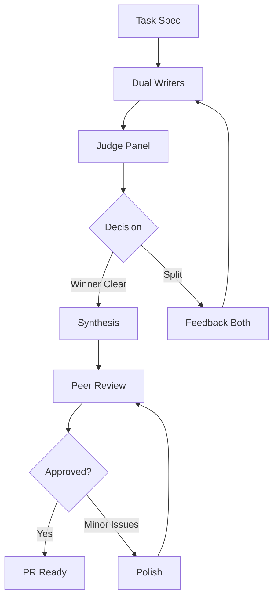

# 🎲 Agent Cube

**Autonomous multi-agent coding workflow for production-grade software development**

Run multiple AI coders in parallel → AI judges pick the best → Automated synthesis → Ready-to-merge PR

```bash
cube auto task.md  # One command: task spec → PR
```

[](https://github.com/aetheronhq/agent-cube)
[](LICENSE)

---

## 🚀 Quick Start

```bash
# Install
./install.sh

# Run autonomous workflow
cube auto implementation/phase-01/tasks/01-my-feature.md

# Monitor progress
cube status 01-my-feature

# Continue from checkpoint
cube continue 01-my-feature
```

**That's it.** The system orchestrates 5+ AI agents from task spec to ready PR.

---

## ✨ Features

### **Competitive Parallel Development**
- **2 AI writers** implement the same task independently (Sonnet + Codex)
- Different approaches, different strengths
- Competition produces better code

### **Judicial Review**
- **3 AI judges** evaluate both implementations
- Objective scoring on KISS, architecture, tests, production-readiness
- Automated decision aggregation

### **Intelligent Synthesis**
- Identifies winning implementation
- Auto-generates targeted feedback for blockers
- Iterates until ready to merge

### **Beautiful Visualization**
- Rich Layout thinking boxes (see AI reasoning in real-time)
- Dual boxes for parallel writers
- Triple boxes for judges
- Clean, organized output

### **Bulletproof State Management**
- Explicit phase tracking
- Resume from any checkpoint
- State backfilling for existing work
- Validates resume points

---

## 📖 Documentation

### **Getting Started**
- [Installation Guide](INSTALL.md) - Setup and dependencies
- [Quick Reference](QUICK_REFERENCE.md) - Common commands

### **Core Concepts**
- [Agent Cube Framework](AGENT_CUBE.md) - Complete framework guide
- [Workflow Automation](AGENT_CUBE_AUTOMATION.md) - Automation details
- [Python Implementation](PYTHON_IMPLEMENTATION.md) - Technical architecture

### **Implementation Details**
- [Implementation Summary](IMPLEMENTATION_SUMMARY.md) - What was built
- [Planning Guide](README-PLANNING.md) - How to create planning docs

---

## 🎯 Core Workflow



**10 Phases:**
1. Generate writer prompt (Prompter AI)
2. Dual writers execute (Sonnet + Codex)
3. Generate panel prompt (Prompter AI)
4. Judge panel review (3 judges)
5. Aggregate decisions
6. Synthesis or Feedback (Prompter AI)
7. Peer review (resume judges)
8. Final decision
9. Minor fixes (if needed)
10. PR creation

**Fully autonomous** - handles every scenario automatically.

---

## 🛠️ Commands

### **Autonomous Workflow**
```bash
cube auto <task-file>              # Full autonomous workflow
cube auto <task-file> --resume-from 7   # Resume from phase
cube auto <task-file> --reset      # Clear state, start fresh
cube continue <task-id>            # Smart continue from checkpoint
```

### **Manual Control**
```bash
cube writers <task> <prompt>       # Launch dual writers
cube panel <task> <prompt>         # Run judge panel
cube decide <task>                 # Aggregate decisions
cube feedback <writer> <task> msg  # Send feedback to writer
cube peer-review <task> <prompt>   # Run peer review
```

### **Utilities**
```bash
cube status [task]                 # Show progress
cube sessions                      # List active sessions
cube logs [task] [agent]           # View agent logs
cube clean <task>                  # Clean up sessions
cube resume <agent> <task> [msg]   # Resume specific agent
```

### **Single Agent**
```bash
cube run <model> "prompt"          # Run single agent
# Models: sonnet-4.5-thinking, gpt-5-codex-high, grok, gemini-2.5-pro
```

---

## ⚙️ Configuration

Edit `python/cube.yaml` to customize:

```yaml
# Writers
writers:
  writer_a:
    model: "sonnet-4.5-thinking"
    label: "Writer A"
    color: "green"
  
  writer_b:
    model: "gpt-5-codex-high"
    label: "Writer B"  
    color: "blue"

# Judges (3 independent reviewers)
judges:
  judge_1:
    model: "sonnet-4.5-thinking"
  judge_2:
    model: "gpt-5-codex-high"
  judge_3:
    model: "gemini-2.5-pro"

# CLI tools for each model
cli_tools:
  sonnet-4.5-thinking: cursor-agent
  gpt-5-codex-high: cursor-agent
  gemini-2.5-pro: gemini
```

**Pluggable:** Add any model via config + adapter.

---

## 📊 Example Output

```
🤖 Agent Cube Autonomous Orchestration
Task: 03-api-client
Progress: Phase 6/10 (60%) - Path: SYNTHESIS

╭─ 💭 Writer A ─────────────────────────────────╮
│ Analyzing judge feedback...                   │
│ Addressing type safety issues...              │
│ Running tests...                              │
╰───────────────────────────────────────────────╯
╭─ 💭 Writer B ─────────────────────────────────╮
│ Implementing circuit breaker...               │
│ Adding error handling...                      │
│ Updating documentation...                     │
╰───────────────────────────────────────────────╯
[Writer A] 📖 src/client.ts
[Writer A]    ✅ 156 lines
[Writer B] 📝 src/config.ts
[Writer B]    ✅ 89 lines

✅ Ready to create PR from: writer-codex/03-api-client
```

---

## 🏗️ Architecture

**Ports & Adapters:**
- CLI Adapters: `cursor-agent`, `gemini`
- Parsers: JSON stream parsing
- Layouts: Rich-based thinking displays

**Core Layers:**
```
CLI Commands (typer)
    ↓
Automation (async workflows)
    ↓
Core (agents, adapters, parsers)
    ↓
External CLIs (cursor-agent, gemini)
```

**Clean separation:** Library (async) + CLI (wrappers)

**DRY:** Base layout + 3 subclasses (single/dual/triple)

---

## 🎓 Advanced Usage

### **Resume from Checkpoint**
```bash
# Auto-continue from last checkpoint
cube continue 05-feature-flags

# Resume from specific phase
cube auto task.md --resume-from 7

# Reset and start fresh
cube auto task.md --reset
```

### **Individual Agent Control**
```bash
# Resume specific judge
cube resume judge-2 task "Write your decision JSON"

# Resume both writers
cube writers task --resume "Complete all tasks"

# Individual feedback
cube feedback codex task "Fix the type errors"
```

### **Monitoring**
```bash
# Task progress
cube status 05-task
→ Phase 7/10 (70%) - Path: SYNTHESIS
→ Winner: Writer B
→ Completed: 1,2,3,4,5,6,7

# View logs
cube logs 05-task              # All logs for task
cube logs 05-task writer-a     # Specific agent
cube logs 05-task judge-2 -n 100  # More lines
```

### **Cleanup**
```bash
cube clean 05-task         # Remove task sessions/state
cube clean --old           # Remove sessions >7 days
cube clean --all           # Remove all completed
```

---

## 🤝 Contributing

Agent Cube is open source! Contributions welcome:

- Add new CLI adapters (Anthropic API, OpenAI, etc.)
- Add new parser formats
- Improve decision logic
- Add integration tests

See [PYTHON_IMPLEMENTATION.md](PYTHON_IMPLEMENTATION.md) for architecture details.

---

## 📝 License

MIT License - see [LICENSE](LICENSE)

---

## 🔗 Links

- **Framework Guide:** [AGENT_CUBE.md](AGENT_CUBE.md)
- **Automation Details:** [AGENT_CUBE_AUTOMATION.md](AGENT_CUBE_AUTOMATION.md)  
- **Quick Reference:** [QUICK_REFERENCE.md](QUICK_REFERENCE.md)
- **Planning Guide:** [README-PLANNING.md](README-PLANNING.md)

---

**Built with:** Python 3.10+, Typer, Rich, asyncio

**Powered by:** cursor-agent, Gemini CLI, and any LLM you configure

**Agent Cube - Autonomous multi-agent development** 🎲✨
