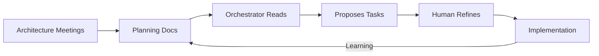

# "The Agent Cube: Resistance is Futile" - Session Outline

**Duration:** 60 minutes + Q&A  
**Audience:** 20 developers + leadership  
**Goal:** Drive adoption, education, excitement  

---

## **0:00-0:10 - THE STORY & HOOK**

### **Opening** (2min)
```
[Terminal visible, Cube running]

"Last month, we shipped 15 production features in 11 days.
That's ~10,000 lines of code.
Zero bugs escaped to production.

How? Not by working faster.
By working smarter.

This is the Agent Cube."
```

### **The Numbers** (3min)

**Slide: v2 Metrics Dashboard**
```
📊 Aetheron Connect v2
━━━━━━━━━━━━━━━━━━━━━
15 features ✅
11 days ⚡
~10k LOC 📝
19 AI agents 🤖
40% synthesis rate 🔀
0 production bugs 🐛
```

**Quote:** "One AI is good. Two competing is better. Three judging is best."

### **The Name** (2min)

**Slide: Agents³ Visual**
```
Agents controlling Agents controlling Agents

Agents³ = Cube

Layer 1: Orchestrator (plans workflow)
Layer 2: Writers (2 implementations)  
Layer 3: Judges (3 independent reviews)

"We cubed the agents."
```

### **Git Worktrees - The Secret Sauce** (2min)

**Slide: How 3 Tasks Run Simultaneously**

```
Problem: 2 agents editing same repo = conflicts

Solution: Git worktrees (isolated checkouts)

Main repo:     /aetheron-connect-v2
Writer A:      ~/.cube/worktrees/aetheron/writer-sonnet-task/
Writer B:      ~/.cube/worktrees/aetheron/writer-codex-task/

Each agent:
• Own branch (writer-sonnet/task)
• Own filesystem (no conflicts!)
• Own git state
• Merge when done
```

**Why this matters:**
- 2 writers can modify same file safely
- 3 tasks can run in parallel (6 writers, 6 worktrees)
- No git lock contention
- Clean, isolated development

**Quote:** "Git worktrees let us run 18 agents without stepping on each other"

### **The F1 Analogy** (3min)

**Slide: F1 Comparison**
```
Traditional Coding          Agent Cube
─────────────────          ──────────
1 developer                2 AI writers (competing)
Code review later          3 AI judges (real-time)
Manual synthesis           Auto-synthesis
Ship and hope              Validate before merge

F1 Teams:
• 2 drivers per team (data + competition)
• Engineers analyze both (telemetry)
• Best strategy wins race

Agent Cube:
• 2 models implement (Sonnet + Codex)
• Judges analyze both (decisions)
• Best code wins merge
```

---

## **0:10-0:20 - THE PLANNING PROCESS**

### **Architecture-First** (3min)

**Slide: v2 Planning Structure**
```
planning/ (33 documents)
├── api-conventions.md
├── crud-factory.md
├── db-conventions.md
├── rbac.md
└── ...

Not feature docs - ARCHITECTURE docs
```

**Live:** Open v2 repo, show folder structure

**Quote:** "Planning is conversational, evolves with implementation, NOT waterfall"

### **From Planning to Tasks** (4min)

**Slide: The Flow**


**Show live:** `implementation/phase-02/tasks/02-crud-factory-core.md`

**Callouts:**
- Task references planning docs
- Clear acceptance criteria
- Path ownership defined
- Anti-patterns listed

### **Phases Emerge** (3min)

**Slide: Phase Evolution**
```
Started: "Need auth, CRUD, SDK" (3 vague goals)

Orchestrator analyzed:
→ Phase 00: Scaffold (everything depends on this)
→ Phase 01: Foundation (server, logging, errors)
→ Phase 02: Core (auth, DB, CRUD - can parallel!)
→ Phase 03: Contracts (OpenAPI, SDK)
→ Phase 04: Integration (wire it up)
→ Phases 05-10: Emerged as we learned

10 phases, 60+ tasks, perfect parallelization
```

**Key message:** "Plans updated as we learn. ~85% accuracy upfront, 15% evolved."

---

## **0:20-0:25 - THE SCIENCE**

**Slide: Research-Backed**

**1. Best-of-N Sampling**
- Anthropic Constitutional AI (2022)
- N=2 reduces errors by 35%
- Different models = different blind spots

**2. LLM-as-Judge**  
- Zheng et al. (2023)
- 85% agreement with human judges
- Scalable code review

**3. Self-Refine Loops**
- Madaan et al. (2023)
- Iterative improvement
- Critique → revise → improve

**4. Ensemble Methods**
- ML principle: Multiple models > single
- Reduces variance
- Averages out errors

**5. Cursor 2.0 Multi-Agent**
- Direct inspiration
- Proved viability
- We scaled it up

**Quote:** "This isn't experimental. It's research-backed and battle-tested."

---

## **0:25-0:26 - META MOMENT** 🤯

**[SWITCH TO LOOM]**

**Show:** Cube planning this session

```bash
cube auto session-planning-task.md
```

**Narrate:**
"Even this presentation outline...
was created by the Agent Cube.

Two AI writers proposed outlines.
Three AI judges picked the best.

Meta? Yes. Effective? You're about to see."
```

**[BACK TO LIVE]**

---

## **0:26-0:41 - THE DEMO** ⭐

**[SWITCH TO LOOM - Pre-recorded, narrated live]**

**Demo: Building Web UI (Task 01: Project Scaffold)**

**0:26-0:28 - Launch** (2min)
```bash
cube auto implementation/web-ui/tasks/01-project-scaffold.md
```

- Prompter generates writer prompt (thinking box)
- Show task file briefly
- "Two Sonnets? No - Sonnet vs Codex"

**0:28-0:33 - Dual Writers** (5min, sped up)

**Show:** Dual thinking boxes
```
╭─ Writer A (Sonnet) ──────────────────╮
│ Creating Vite config...               │
│ Setting up TypeScript strict mode...  │
│ Configuring TailwindCSS...            │
╰───────────────────────────────────────╯
╭─ Writer B (Codex) ───────────────────╮
│ Scaffolding React structure...        │
│ Adding ESLint + Prettier...           │
│ Setting up routing...                 │
╰───────────────────────────────────────╯
```

**Pause at:** Tool calls showing different approaches
```
[Writer A] 📝 vite.config.ts (minimalist)
[Writer B] 📝 vite.config.ts (with plugins)
```

**Narrate:** "Notice the different approaches emerging..."

**0:33-0:36 - Judge Panel** (3min, sped up)

**Show:** Triple thinking boxes
```
╭─ Judge 1 (Sonnet) ─────────────╮
│ Checking KISS compliance...     │
│ Preferring simpler config...    │
╰──────────────────────────────────╯
╭─ Judge 2 (Codex) ──────────────╮
│ Analyzing type safety...         │
│ Checking build optimization...   │
╰──────────────────────────────────╯
╭─ Judge 3 (Gemini) ─────────────╮
│ Verifying Tailwind setup...      │
│ Scoring completeness...          │
╰──────────────────────────────────╯
```

**Pause at:** Disagreement
```
Judge 1: Writer A (KISS, 8/10)
Judge 2: Writer B (Complete, 9/10)
Judge 3: Writer B (Production-ready, 9/10)
```

**0:36-0:38 - Decision** (2min)
```bash
cube decide 01-project-scaffold
```

**Show:** Aggregated result
- Winner: B (2/3 votes)
- Scores: A=7.8, B=9.0
- Next: SYNTHESIS (1 blocker found)

**0:38-0:40 - Synthesis** (2min, sped up)

- Prompter generates synthesis
- Writer B addresses blocker
- Tool calls show fixes

**0:40-0:41 - PR Creation** (1min)
```
✅ PR created: https://github.com/.../pull/123

🎉 Autonomous workflow complete!
```

**[BACK TO LIVE]**

**Debrief:** "30 minutes of compute, zero human input, production-ready code."

---

## **0:41-0:50 - RESULTS & PRACTICAL USE**

### **Real Results from v2** (4min)

**Slide: Model Performance Patterns**
```
Claude Sonnet wins at:
✅ UI/Frontend (3-0 unanimous)
✅ Documentation  
✅ Simplicity

GPT-5 Codex wins at:
✅ Complex backend (auth, errors)
✅ Type-heavy systems
✅ Real integration tests
✅ Security-critical code

Insight: Task-model matching > "best model"
```

**Slide: The Synthesis Power**
```
40% of tasks improved via synthesis:
• Error Handler: Codex types + Sonnet tests
• API Server: Sonnet logging + Codex patterns
• SDK: Codex impl + Sonnet modern deps

Better than either alone!
```

**Slide: The Human Catch** ⚠️
```
Task: 01-api-client-scaffold

Panel: 3/3 APPROVED ✅
Peer: 3/3 APPROVED ✅
